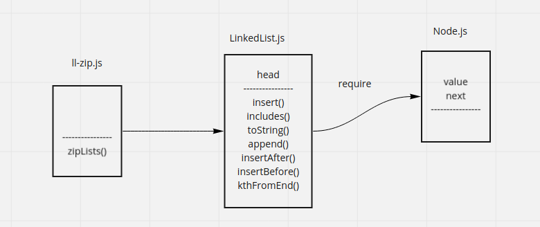

# Singly Linked List
linked list is a data structure has just one pointer called **head**;

# Challenge
zip two linkedLists

# UML

# API

## zipLists(list1, list2) ⇒ <code>LinkedList</code>
[zipLists to concatenate two lists]

**Kind**: global function  

| Param | Type |
| --- | --- |
| list1 | <code>LinkedList</code> |
| list2 | <code>LinkedList</code> |
