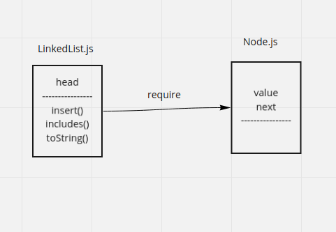

# Singly Linked List
linked list is a data structure has just one pointer called **head**;

# Challenge
implement Singly Linked List in ES6 and test it

# UML

# API

## Classes

<dl>
<dt><a href="#LinkedList">LinkedList</a></dt>
<dd></dd>
<dt><a href="#Node">Node</a></dt>
<dd></dd>
</dl>

## Functions

<dl>
<dt><a href="#insert">insert(value)</a></dt>
<dd>
[insert methd]

</dd>
<dt><a href="#includes">includes(value)</a> ⇒ <code>boolean</code></dt>
<dd>
check if LinkedList includes this value

</dd>
<dt><a href="#toString">toString()</a> ⇒ <code>String</code></dt>
<dd>
[toString to print the linked list]

</dd>
</dl>

## LinkedList
**Kind**: global class  
**Properties**

| Name |
| --- |
| head |

## Node
**Kind**: global class  
**Properties**

| Name | Type |
| --- | --- |
| value | <code>\*</code> |
| [] | [<code>Node</code>](#Node) |

## insert(value)
[insert methd]

**Kind**: global function  

| Param | Type |
| --- | --- |
| value | <code>\*</code> |

## includes(value) ⇒ <code>boolean</code>
check if LinkedList includes this value

**Kind**: global function  

| Param | Type |
| --- | --- |
| value | <code>\*</code> |

## toString() ⇒ <code>String</code>
[toString to print the linked list]

**Kind**: global function  
