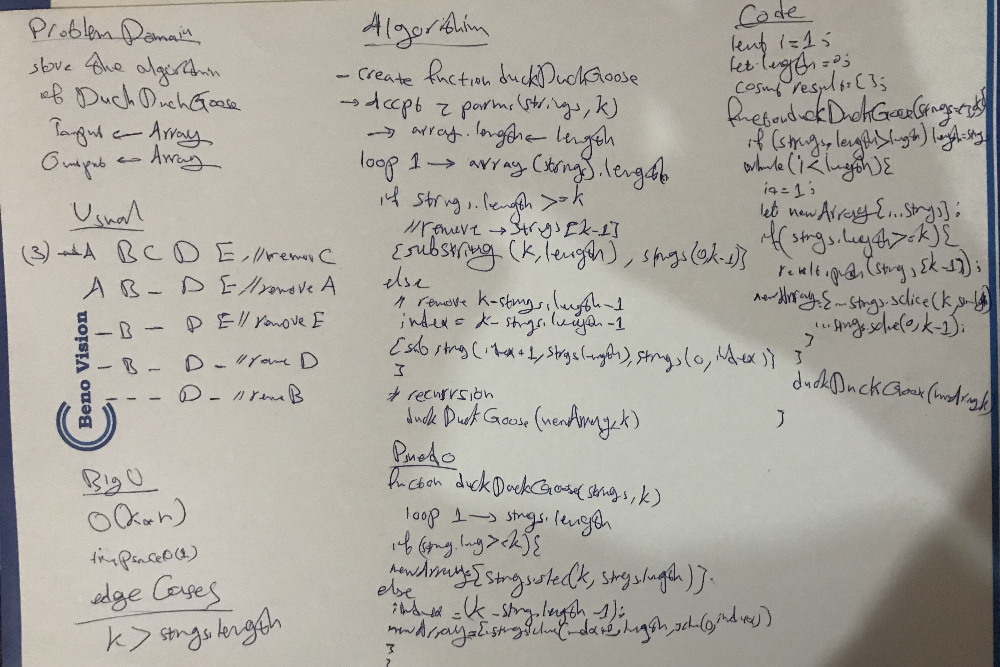

# DuckDuckGoose
DuckDuckGoose is a famous aglorithim

## Challenge
To immplement the DuckDuckGoose algorithim

## Approach & Efficiency
The Big(o) of the algorithm is o(k*n)

## API

## duckDuckGoose([strings], k) ⇒ <code>array</code>
[duckDuckGoose]

**Kind**: global function  
**Returns**: <code>array</code> - "result"  

| Param | Type | Default | Description |
| --- | --- | --- | --- |
| [strings] | <code>Array</code> | <code>[]</code> | "list of strings" |
| k | <code>number</code> |  | "number of rounds" |

## Whiteboard

