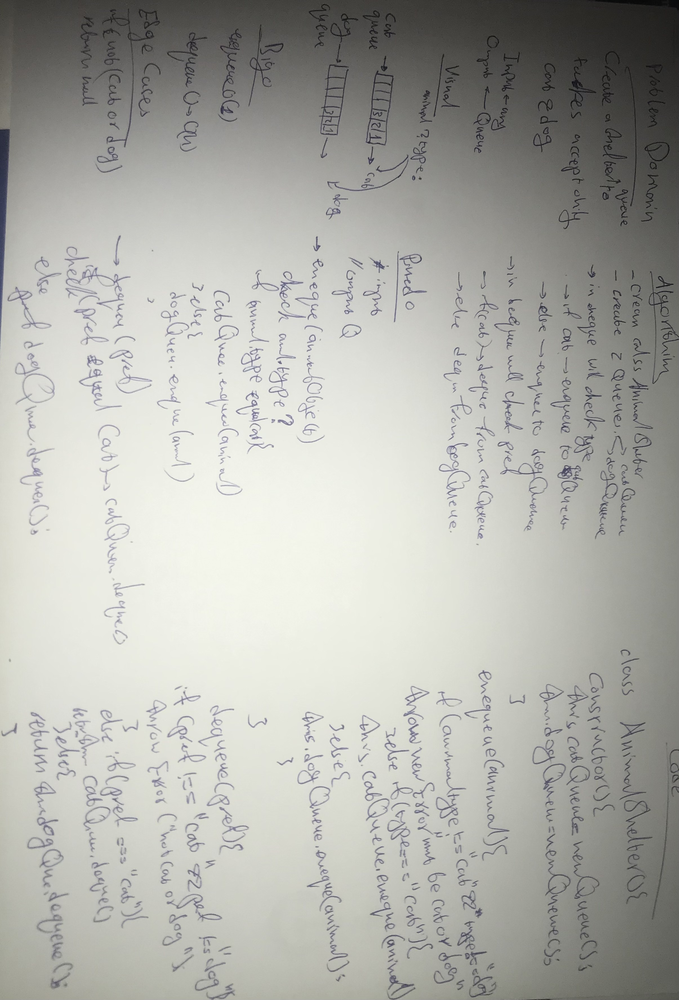

# fifoAnimalShelter
create a shelter queue (FIFO) accepts only "cat & dog"

## Whiteboard

## API

<dl>
<dt><a href="#AnimalShelter">AnimalShelter</a></dt>
<dd></dd>
</dl>

## Functions

<dl>
<dt><a href="#enqueue">enqueue(animal)</a></dt>
<dd>
[enqueue]

</dd>
<dt><a href="#dequeue">dequeue(pref)</a> ⇒ <code>object</code></dt>
<dd>
[dequeue]

</dd>
</dl>

## AnimalShelter
**Kind**: global class  

### new AnimalShelter()
[AnimalShelter]

## enqueue(animal)
[enqueue]

**Kind**: global function  

| Param | Type |
| --- | --- |
| animal | <code>object</code> |

## dequeue(pref) ⇒ <code>object</code>
[dequeue]

**Kind**: global function  

| Param | Type | Description |
| --- | --- | --- |
| pref | <code>pref</code> | "cat"||"dog" |
