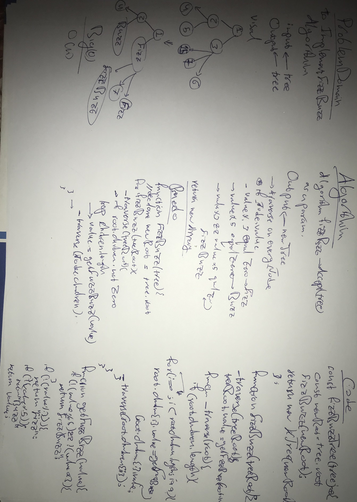

## Tree
a tree is a widely used abstract data type that simulates a hierarchical tree structure, with a root value and subtrees of children with a parent node, represented as a set of linked nodes.

## Challenge
to implement **fizzBuzz** algorithm

## Approach & Efficiency
Big(o) is o(n)

## WhiteBoard

## API

## Classes

<dl>
<dt><a href="#KNode">KNode</a></dt>
<dd></dd>
<dt><a href="#KTree">KTree</a></dt>
<dd></dd>
</dl>

## Functions

<dl>
<dt><a href="#fizzBuzzTree">fizzBuzzTree(tree)</a> ⇒ <code>newTree</code></dt>
<dd></dd>
</dl>

## KNode
**Kind**: global class  

### new KNode([value])
[KNode]

| Param | Type | Default |
| --- | --- | --- |
| [value] | <code>\*</code> | <code></code> |

## KTree
**Kind**: global class  

### new KTree(root)
[KTree]

| Param | Type |
| --- | --- |
| root | [<code>KNode</code>](#KNode) |

## fizzBuzzTree(tree) ⇒ <code>newTree</code>
**Kind**: global function  
**Returns**: <code>newTree</code> - new fuzzed and buzzed Tree  

| Param | Type | Description |
| --- | --- | --- |
| tree | <code>tree</code> | tree you want to fizzBuzz |
