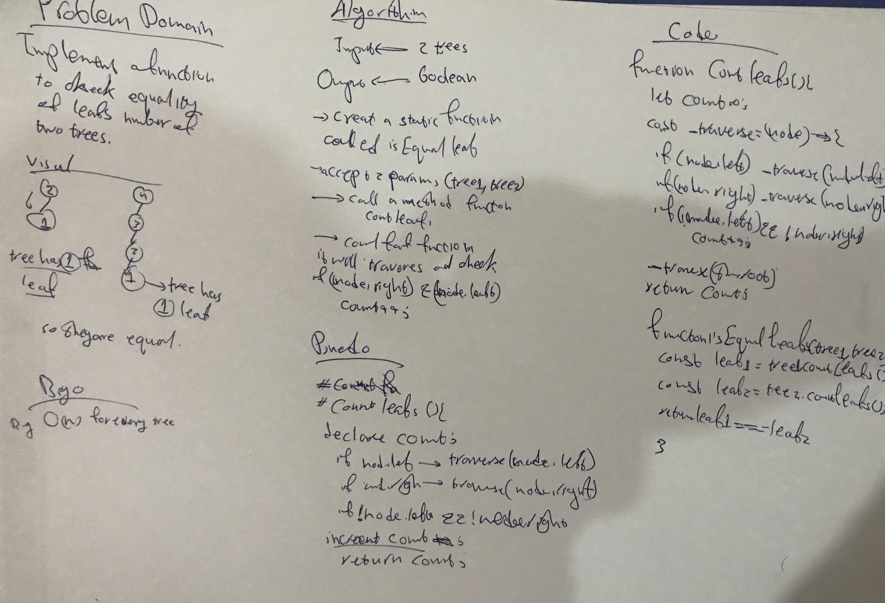

## Tree
a tree is a widely used abstract data type that simulates a hierarchical tree structure, with a root value and subtrees of children with a parent node, represented as a set of linked nodes.

## Challenge
to implement a function to check equality of leafs number of two trees

## Approach & Efficiency
Big(o) is o(n)

## WhiteBoard

## API

### Classes

<dl>
<dt><a href="#BinaryTree">BinaryTree</a></dt>
<dd></dd>
<dt><a href="#Node">Node</a></dt>
<dd></dd>
</dl>

### Functions

<dl>
<dt><a href="#countLeafs">countLeafs()</a> ⇒ <code>number</code></dt>
<dd>
[countLeafs]

</dd>
<dt><a href="#isEqualLeafs">isEqualLeafs(tree1, tree2)</a> ⇒ <code>Boolean</code></dt>
<dd>
[isEqualLeafs description]

</dd>
<dt><a href="#preOrder">preOrder(node)</a> ⇒</dt>
<dd>
[preOrder]

</dd>
<dt><a href="#inOrder">inOrder(node)</a> ⇒</dt>
<dd>
[inOrder]

</dd>
<dt><a href="#postOrder">postOrder(node)</a> ⇒</dt>
<dd>
[postOrder]

</dd>
</dl>

## BinaryTree
**Kind**: global class  
**Properties**

| Name | Type |
| --- | --- |
| root | [<code>Node</code>](#Node) |

## Node
**Kind**: global class  

### new Node(value, left, right)

| Param | Type | Default | Description |
| --- | --- | --- | --- |
| value | <code>\*</code> |  |  |
| left | [<code>Node</code>](#Node) | <code></code> | default |
| right | [<code>Node</code>](#Node) | <code></code> | default |

## countLeafs() ⇒ <code>number</code>
[countLeafs]

**Kind**: global function  

## isEqualLeafs(tree1, tree2) ⇒ <code>Boolean</code>
[isEqualLeafs description]

**Kind**: global function  
**Returns**: <code>Boolean</code> - [description]  

| Param | Type |
| --- | --- |
| tree1 | <code>tree</code> |
| tree2 | <code>tree</code> |

## preOrder(node) ⇒
[preOrder]

**Kind**: global function  
**Returns**: [Node}  array of Nodes in preOrder  

| Param | Type |
| --- | --- |
| node | [<code>Node</code>](#Node) |

## inOrder(node) ⇒
[inOrder]

**Kind**: global function  
**Returns**: [Node}  array of Nodes in inOrder  

| Param | Type |
| --- | --- |
| node | [<code>Node</code>](#Node) |

## postOrder(node) ⇒
[postOrder]

**Kind**: global function  
**Returns**: [Node}  array of Nodes in postOrder  

| Param | Type |
| --- | --- |
| node | [<code>Node</code>](#Node) |
