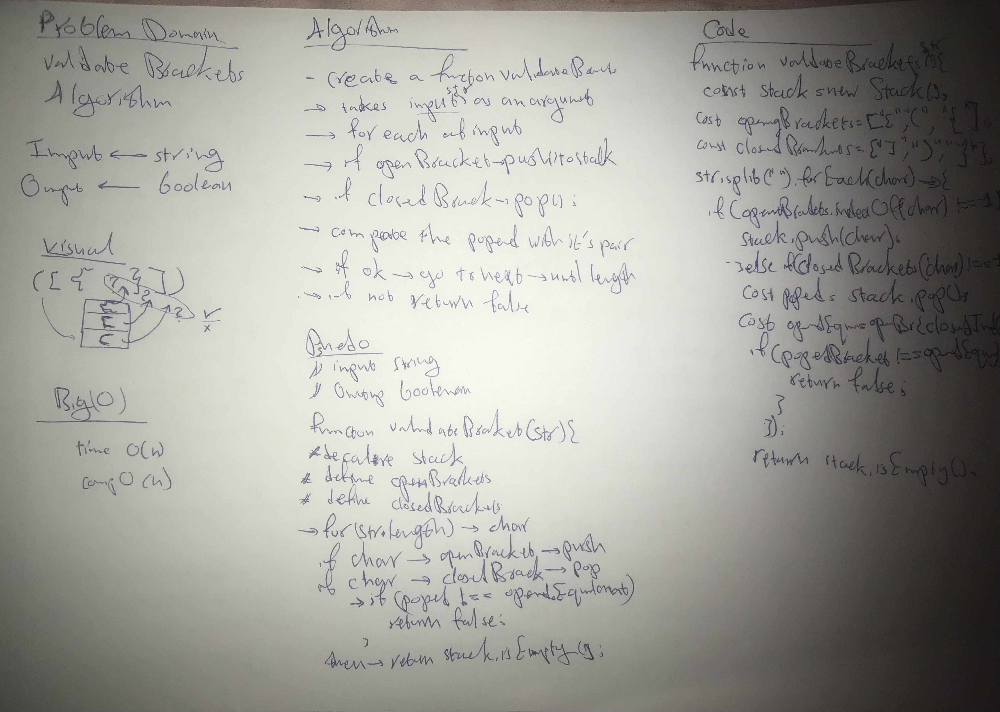

# Multi Bracket Validation
create a function that takes a string as an argument it will return a boolean representing whether or not the brackets in the string are balanced. There are 3 types of brackets:
- **Round Brackets : ()**
- **Square Brackets : []**
- **Curly Brackets : {}**

## Challenge
- create function takes a string as an argument.
- this function will check the brackets
- return true input if matches the algorithm policies

## White Board

## vaidateBrackets(str) ⇒ <code>boolean</code>
[exports description]

**Kind**: global function  

| Param | Type |
| --- | --- |
| str | <code>string</code> |
