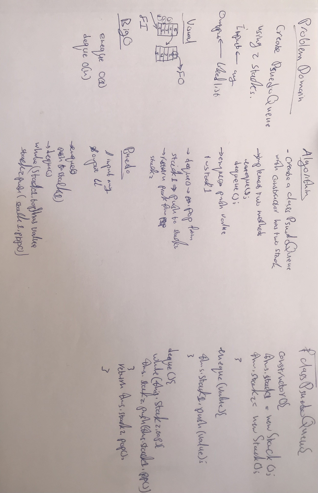

# Pseudo Queue
Queue using 2 stacks implentation

## API

<dl>
<dt><a href="#PseudoQueue">PseudoQueue</a></dt>
<dd></dd>
</dl>

## Functions

<dl>
<dt><a href="#enqueue">enqueue()</a></dt>
<dd>
[enqueue]

</dd>
<dt><a href="#dequeue">dequeue()</a> ⇒ <code>*</code></dt>
<dd>
[dequeue]

</dd>
</dl>

## PseudoQueue
**Kind**: global class  
**Pseudoqueue**: constructor  
**Properties**

| Name |
| --- |
| stack1 |
| stack2 |

### new PseudoQueue()
[PseudoQueue]

## enqueue()
[enqueue]

**Kind**: global function  

| Type |
| --- |
| <code>\*</code> |

## dequeue() ⇒ <code>\*</code>
[dequeue]

**Kind**: global function  
