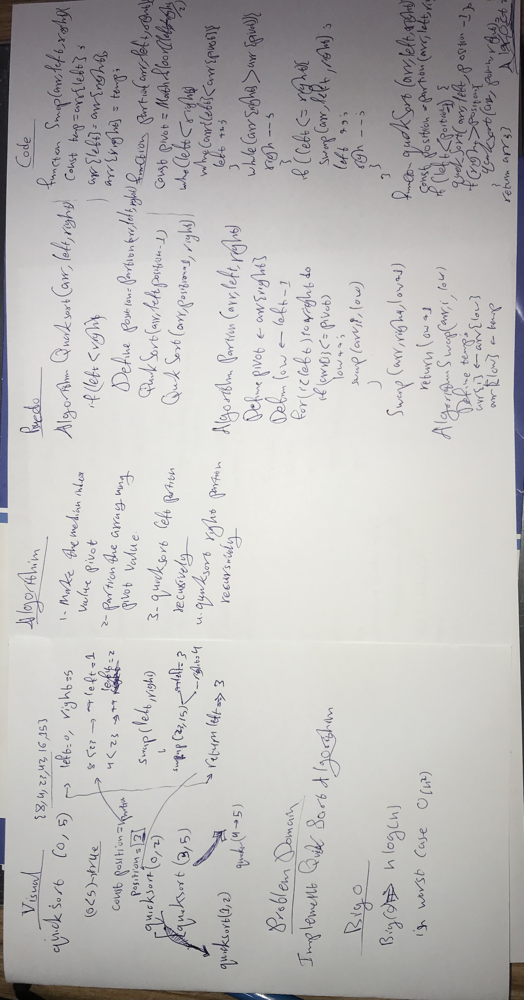
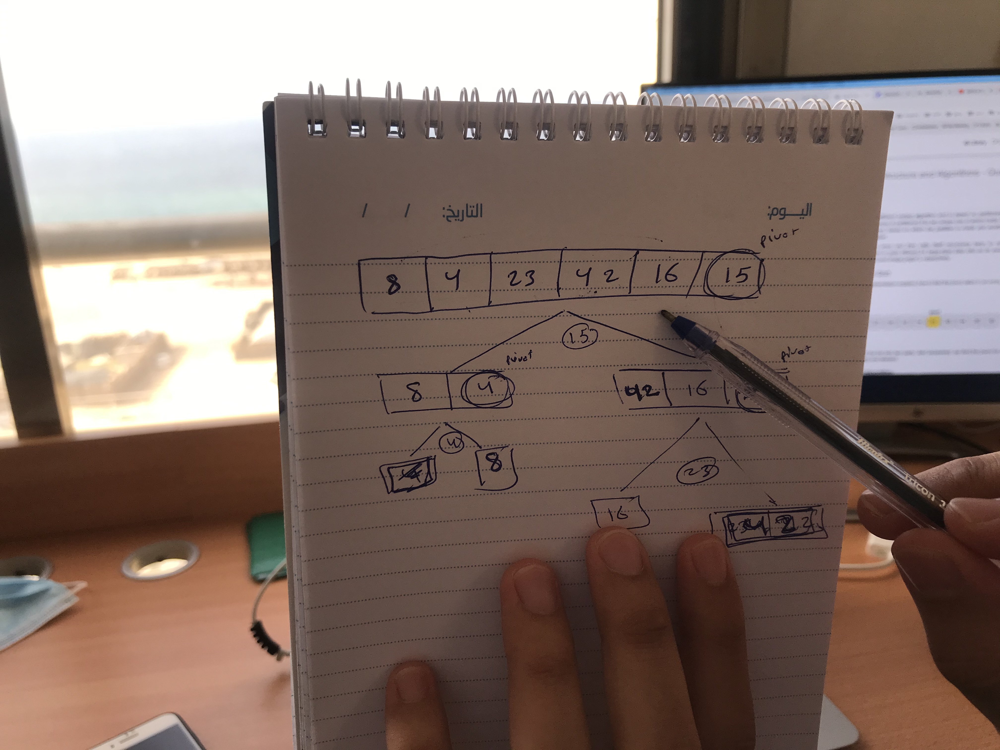

# Challenge Summary
implement the quickSort algorithm

## Challenge Description
Create a function take an array and returned sorted using quickSort ALGORITHM

## Approach & Efficiency
 the algorithm takes O(n log n) comparisons to sort n items. In the worst case, it makes O(n2) comparisons,

## Solution
<!-- Embedded whiteboard image -->

### Visual of CodeFellow-Partition ALGORITHM
`Abdullah Safi Explained it`

